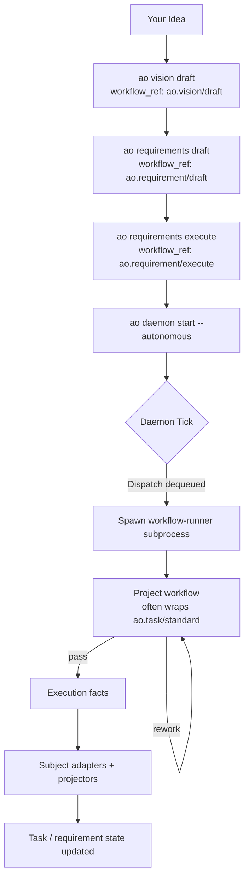

# A Typical Day Using Animus

This is the common end-to-end loop: define intent, generate requirements,
materialize tasks, and let the daemon execute task workflows.

## The Lifecycle



## Typical Flow

### 1. Define intent

```bash
animus vision draft
animus requirements draft --include-codebase-scan
animus requirements refine --id REQ-001
```

Canonical refs for those commands are:

- `ao.vision/draft`
- `ao.requirement/draft`
- `ao.requirement/refine`

### 2. Turn requirements into work

```bash
animus requirements execute
```

This runs `ao.requirement/execute`, which plans and materializes task work
through Animus mutation surfaces.

### 3. Let task workflows run

```bash
animus daemon start --autonomous
```

Project-local task refs such as `standard-workflow` usually delegate to bundled
pack refs like `ao.task/standard`.

### 4. Watch the system

```bash
animus task stats
animus workflow list
animus daemon health
animus output tail
```

## What the Daemon Actually Does

The daemon:

- dequeues `SubjectDispatch` items
- checks capacity
- spawns runner subprocesses
- records execution facts

The daemon does not own task semantics, requirement semantics, or pack logic.

## Why This Matters

That split lets Animus support:

- bundled first-party packs such as `ao.task` and `ao.requirement`
- installed machine packs under `~/.ao/packs/`
- project overrides in `.ao/plugins/`
- subprocess-based Node and Python integrations

without expanding daemon responsibilities.
