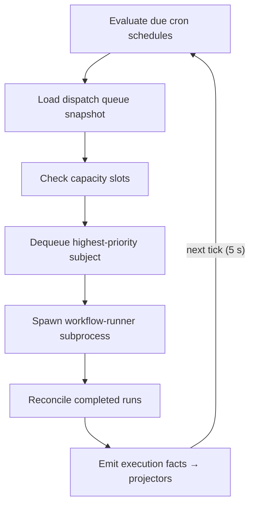

# Autonomous Mode Guide

Autonomous mode is the configuration in which the Animus daemon continuously monitors your project, picks up ready tasks, fires scheduled workflows, and reacts to external events — all without manual invocation. This guide explains how to start the daemon autonomously, how task pickup works, how to configure cron schedules and event triggers, where to observe activity, and how autonomous execution differs from running an agent by hand.

---

## Autonomous Mode vs. Manual Agent Run

Understanding the distinction helps you choose the right invocation model for a given situation.

| Dimension | Autonomous mode | Manual agent run |
|---|---|---|
| **Who starts execution** | Daemon — on its own tick, schedule, or trigger | You — explicit CLI command |
| **Task selection** | Daemon picks the highest-priority ready task | You choose a specific task or workflow |
| **Concurrency** | Up to `max_workflows` in parallel | One run per invocation |
| **Persistence** | Daemon stays alive; picks up more work after each run | Process exits when the workflow finishes |
| **Output visibility** | Streamed to `.ao/daemon.log`; queryable via CLI | Stdout/stderr of the foreground process |
| **When to use** | Continuous background throughput, nightly jobs, CI integration | One-off experiments, debugging, interactive authoring |

The autonomous daemon and manual invocations share the same workflow definitions, agent profiles, and MCP tools. The only difference is _who decides when to start_.

---

## Starting the Daemon in Autonomous Mode

```bash
animus daemon start --autonomous
```

This forks a child process that runs independently of your terminal session. The child process:

1. **Detaches** from the parent — closing your terminal does not kill it.
2. **Redirects stderr** to `.ao/daemon.log` (rotated at 10 MB; rotated file: `.ao/daemon.log.1`).
3. **Writes a PID file** to `.ao/daemon-state.json` so the CLI can find and signal it.
4. **Begins the tick loop** immediately.

Verify the daemon is running after start:

```bash
animus daemon status
```

Expected output:

```
Daemon  running   PID 12345   uptime 3s
Active  0 workflows
Queue   0 pending
```

### Foreground Alternative

For debugging, run the daemon in the foreground instead:

```bash
animus daemon run
```

Output goes directly to stdout. Press Ctrl+C to stop. All other behaviour is identical — tick loop, schedule evaluation, trigger processing.

### Active Hours

The daemon supports an `active_hours` gate that prevents proactive dispatches outside a configured window:

```bash
animus daemon config --set active_hours="09:00-18:00"
```

Schedules and ready-task pickup are suppressed outside this window. Manually triggered dispatches (MCP calls, webhooks) are not affected by `active_hours`. Omit the setting or set it to an empty string to disable gating.

---

## How Task Pickup Works

The daemon runs a periodic tick (default every 5 seconds). On each tick it:

1. **Evaluates due schedules** — checks cron expressions against the last run time.
2. **Loads the dispatch queue** — ordered by priority, then by `requested_at`.
3. **Checks capacity** — computes available slots (`max_workflows − active − headroom`).
4. **Dequeues and spawns** — starts `workflow-runner` subprocesses for the highest-priority ready entries that fit within capacity.
5. **Reconciles completions** — collects finished subprocesses, emits execution facts, and projects outcomes back to task/workflow state.



A task becomes eligible for pickup when its status is `ready`. Transition a task to ready manually:

```bash
animus task status --id TASK-001 --status ready
```

Or configure the daemon to auto-promote tasks:

```bash
animus daemon config --set auto_run_ready=true
```

With `auto_run_ready=true`, tasks that reach `ready` status (via requirements completion, manual promotion, or MCP tool calls) are enqueued automatically without further action.

### Capacity Controls

| Setting | Default | Description |
|---|---|---|
| `max_workflows` | `3` | Hard upper bound on concurrent `workflow-runner` subprocesses |
| `slot_headroom` | `1` | Reserved slots to avoid full saturation; allows high-priority work to start |
| `auto_run_ready` | `false` | Automatically enqueue tasks when they reach `ready` status |

```bash
animus daemon config --set max_workflows=5
animus daemon config --set slot_headroom=1
```

---

## Cron Schedules

Schedules dispatch a workflow on a recurring cron expression, independent of the task queue. They are useful for nightly audits, periodic report generation, or maintenance workflows.

### Declaring Schedules

Declare schedules in the `schedules` section of `.ao/workflows.yaml`:

```yaml
# .ao/workflows.yaml
daemon:
  active_hours: "09:00-18:00"

schedules:
  nightly-cleanup:
    cron: "0 2 * * *"           # 02:00 UTC every day
    workflow_ref: ao.task/standard
    subject:
      kind: ao.task
      id: "cleanup-nightly"
      title: "Nightly cleanup run"
    vars:
      mode: cleanup

  weekly-audit:
    cron: "0 9 * * MON"         # 09:00 UTC every Monday
    workflow_ref: ao.task/standard
    subject:
      kind: ao.task
      id: "weekly-audit"
      title: "Weekly dependency audit"
```

**Cron format:** 5-field standard cron (`minute hour day-of-month month day-of-week`), evaluated in UTC.

| Field | Range | Example |
|---|---|---|
| minute | 0–59 | `30` |
| hour | 0–23 | `2` |
| day of month | 1–31 | `*` |
| month | 1–12 or JAN–DEC | `*` |
| day of week | 0–7 or SUN–SAT | `MON` |

Common expressions:

| Expression | Meaning |
|---|---|
| `0 * * * *` | Every hour, on the hour |
| `0 2 * * *` | Daily at 02:00 UTC |
| `0 9 * * MON` | Every Monday at 09:00 UTC |
| `*/15 * * * *` | Every 15 minutes |
| `0 0 1 * *` | First day of each month at midnight |

### Schedule State and Idempotency

The daemon stores schedule run history in `.ao/state/schedule-state.json`. On each tick, it compares the cron expression against the last recorded run to determine whether the schedule is due. A schedule fires at most once per cron period — restarting the daemon mid-period does not cause a duplicate run.

### Reloading After Changes

After editing `.ao/workflows.yaml`, reload the daemon to pick up the new schedule configuration without restarting:

```bash
animus daemon reload
```

### Viewing Schedule History

```bash
animus daemon events --filter schedule
```

---

## Event Triggers

Event triggers fire a workflow in response to external activity: a file change on disk or an inbound HTTP webhook. Both mechanisms produce a `SubjectDispatch` envelope identical to any other dispatch source, so the same workflow definitions apply.

Declare triggers in `.ao/triggers.yaml`:

```yaml
triggers:
  # React to changes in the docs directory
  - id: on-docs-change
    kind: file-watch
    watch:
      paths:
        - docs/**/*.md
      events:
        - create
        - modify
      debounce_ms: 1000
    dispatch:
      workflow_ref: ao.task/standard
      subject:
        kind: ao.task
        id: "docs-review"
        title: "Review updated docs"

  # Accept a webhook from CI
  - id: on-ci-complete
    kind: webhook
    webhook:
      path: /hooks/ci-complete
      method: POST
    dispatch:
      workflow_ref: ao.task/standard
      subject:
        kind: ao.task
        id: "{{ payload.task_id }}"
        title: "Post-CI: {{ payload.task_title }}"
```

The daemon starts watching declared paths and listening on declared webhook endpoints when it starts. Changes to `.ao/triggers.yaml` take effect on `animus daemon reload`.

For the full trigger configuration reference — field definitions, debounce behaviour, payload interpolation, conditional filters, priority routing, dead-letter queue, and managing triggers via CLI — see [Event Triggers: File Watchers and Webhooks](event-triggers.md).

---

## Dashboard Visibility

### Local CLI

The primary observability surface for a locally running daemon:

```bash
# Live daemon state and active workflow count
animus daemon status

# Structured event stream (dispatches, completions, failures)
animus daemon events

# Tail the structured JSON log
animus daemon logs

# Agents currently managed by the daemon
animus daemon agents

# Per-trigger fire counts and status
animus trigger stats
```

To follow output from a specific workflow in real time:

```bash
animus output tail --task-id TASK-001
```

To inspect a specific workflow:

```bash
animus workflow list
animus workflow get --id <workflow-id>
```

### Web Dashboard (Local)

The local web UI provides a board view and workflow graph:

```bash
animus web start
```

Navigate to `http://localhost:8842` (default port). The **Board** view shows tasks grouped by status. The **Workflows** view shows active and completed runs with phase-level detail. See [Web Dashboard](web-dashboard.md) for navigation reference.

### Cloud Dashboard

If your project is linked to Animus Cloud, the browser dashboard at `app.ao.dev` shows:

| Section | What you see |
|---|---|
| **Agents** | Live and historical agent runs, phase progress, model usage |
| **Deployments** | Daemon deployment status, environment configuration |
| **Logs** | Full-text search across all autonomous runs |
| **Daemon → Queue** | Pending dispatch queue, active slots, dead-letter items |

The cloud daemon is the same scheduler running as a managed process. Its tick loop, schedule evaluation, and trigger processing behave identically to the local daemon. For cloud-specific management — sizing, drain mode, restart policies, and the health timeline — see [Cloud Daemon Management](cloud-daemon-management.md).

---

## Common Patterns

### Fully Autonomous: Create, Queue, and Forget

```bash
# Configure automation flags once
animus daemon config --set auto_pr=true
animus daemon config --set auto_merge=true
animus daemon config --set auto_run_ready=true

# Start daemon
animus daemon start --autonomous

# Create tasks — the daemon picks them up automatically
animus task create \
  --title "Refactor auth module" \
  --type feature \
  --priority high
# (task transitions to ready; daemon dispatches immediately)
```

### Pause During Manual Work

Pause dispatch without stopping the daemon. In-progress workflows continue; no new work starts:

```bash
animus daemon pause
# edit files, review outputs, run manual commands...
animus daemon resume
```

### Watch Autonomous Activity

```bash
# Two terminals
animus daemon events          # terminal 1: live event stream
animus output tail --task-id TASK-001  # terminal 2: agent output
```

### Debug a Task Not Being Picked Up

```bash
# 1. Confirm task is in ready status
animus task get --id TASK-001

# 2. Check daemon is running
animus daemon status

# 3. Check capacity (is max_workflows reached?)
animus daemon health

# 4. Look for dispatch errors
animus daemon logs

# 5. Check if active_hours is gating dispatch
animus daemon config
```

---

## Related

- [Daemon Operations](daemon-operations.md) — Full CLI reference for start, stop, pause, configure, and monitor
- [Event Triggers: File Watchers and Webhooks](event-triggers.md) — Full trigger configuration reference
- [Writing Custom Workflows](writing-workflows.md) — Authoring the workflows that autonomous mode dispatches
- [First Autonomous PR in 5 Minutes](first-autonomous-pr.md) — Quickstart walkthrough
- [Cloud Daemon Management](cloud-daemon-management.md) — Managing the cloud-hosted daemon
- [The Daemon](../concepts/daemon.md) — Architecture: tick loop, capacity, execution facts
